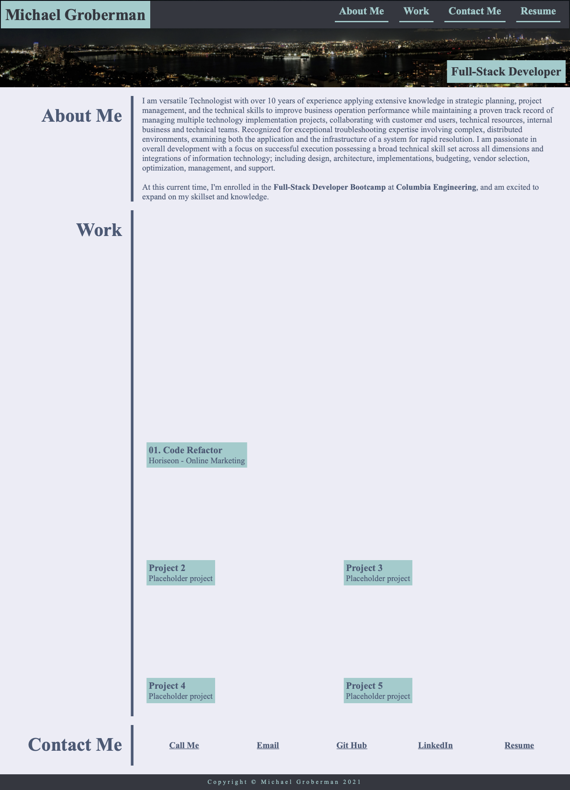

# Michael Groberman - Personal Portfolio
## Project Description
This assignment involed using advanced css and applying it to style our html webpage. 

My site contains my name in the upper-left of the header, and a navigational nav to the right.
It includes my resume, links to my contact information, and external links to my LinkedIn profile, and GitHub profile. 
The site is responsive, and really utilizes flex classes in style.css 
## Contents
1. [Deployed Page](#deployed-page)
2. [Refactor Comments](#refactor-comments)
3. [Contributions](#contributions)

## Deployed Page

[Deployed GitPage](https://michaeladamgroberman.github.io/MichaelGroberman-Portfolio/)
